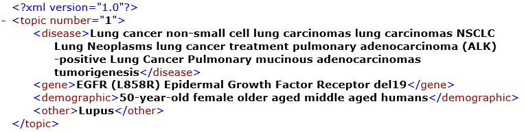
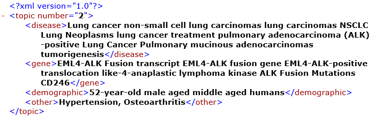
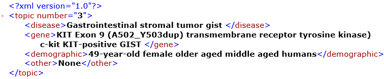
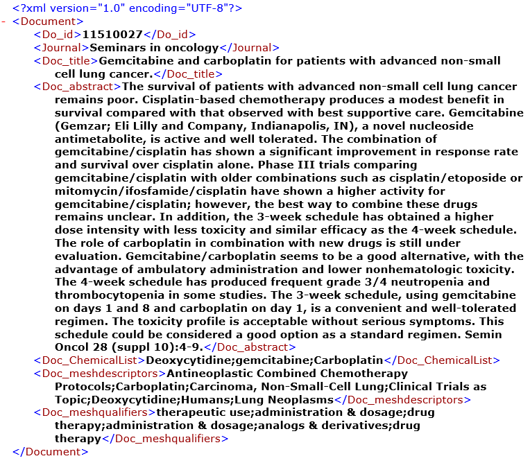

# Topic Modeling & Document Ranking

As mentioned by [Waterford Technologies](https://waterfordtechnologies.com/big-data-interesting-facts/), "the volume of business data worldwide, across all organizations, doubles every 1.2 years". With an overwhelming amount of data available nowadays, the task of finding relevant information for a research topic may take several days, weeks, or months. This project focuses on extracting topics from a large collection of textual information to help researchers, academic professionals, and students to quickly identify relevant documents for their topics while minimizing the time and effort put into the information collection and reviewing process.

## Dataset

The dataset contains a collection of xml documents including three query topics and 333 abstracts of  scientific articles from [PubMed](https://www.ncbi.nlm.nih.gov/pubmed/) and [TREC 2017](http://www.trec-cds.org/2017.html).

 - The __topic__ contains information about a single patient suffering from a disease. A name is assigned to each topic for ease of information recall when performing data analysis.  

    - Topic 1: __lung cancer, egfr, aged female__
    
         
    
    - Topic 2: __lung cancer, eml4-alk, aged male__
    
         
    
    - Topic 3: __gist, kit exon, aged female__

         
    
 - The __abstract__ contains information about a particular type of cancer. The document’s id is same as xml file’s name. Below is a sample document:
    
